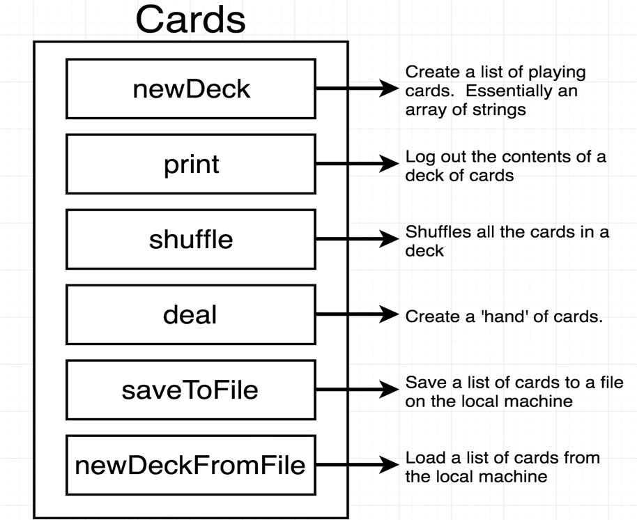
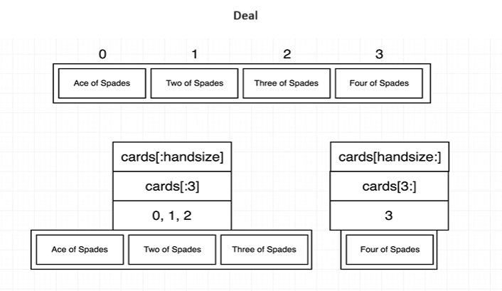
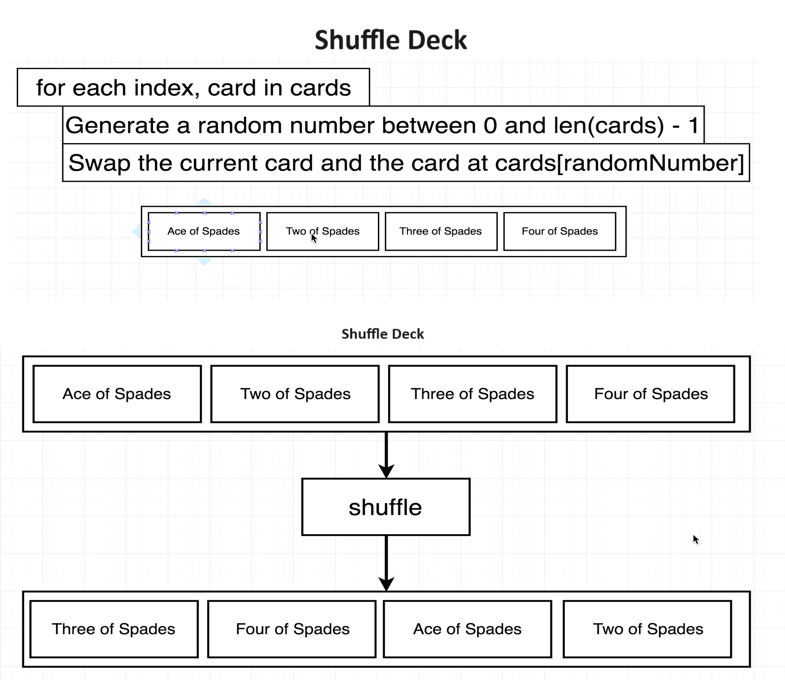
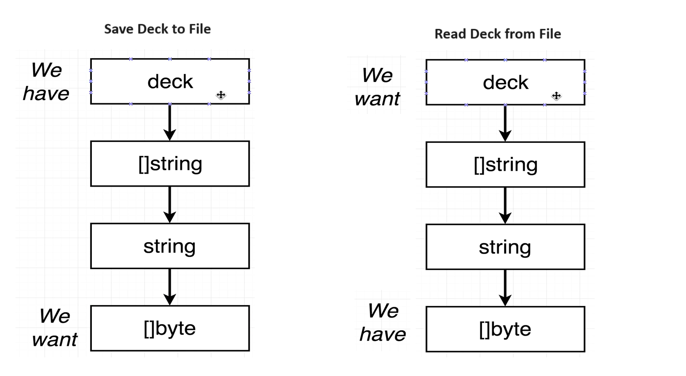
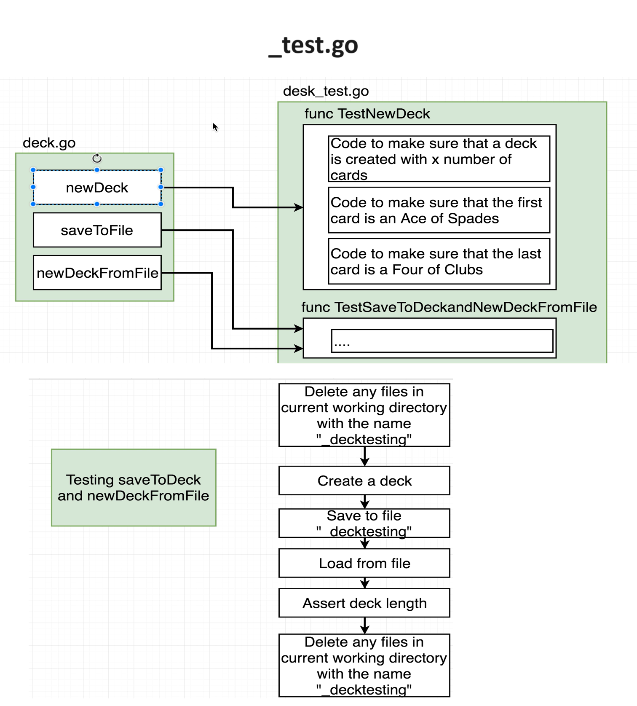

# cards : Go Project Review

## Overview

The project focuses on creating and manipulating decks of cards in Go:

- Created a custom type `deck`, which is a slice of strings representing a deck of cards.
- Implemented functions for printing a deck, creating a new deck, dealing cards, converting a deck to a string, saving a deck to a file, and loading a deck from a file.
- Added a method to shuffle the cards in a deck using the Fisher-Yates shuffle algorithm.
- Utilized Go's standard library packages for file I/O, string manipulation, and random number generation.

## Key Features

### Deck Operations

- `newDeck`: Generates a new deck of cards with all possible combinations of card values and suits.
- `deal`: Splits a deck into two parts, representing a hand of cards and the remaining cards.

- `shuffleCards`: Shuffles the order of cards in a deck to introduce randomness.

### File Operations

- `saveToFile`: Saves the contents of a deck to a text file for later retrieval.
- `newDeckFromFile`: Loads a deck of cards from a text file, allowing users to resume a game or share decks with others.

## Test Cases

### TestNewDeck

- Checks if a new deck is created with the expected number of cards (52).
- Verifies if the first card is "Ace of Clubs" and the last card is "King of Spades".

### TestDeal

- Tests the `deal` function by dealing a hand of 5 cards from a deck.
- Prints the hand and the remaining cards to verify the functionality.

### TestSaveToFileAndNewDeckFromFile

- Tests saving a deck to a file and then loading it back from the file.
- Verifies if the loaded deck has the expected number of cards (52).

## Package Structure
- The project starts with the standard `package main` declaration.
- We import various packages that we need for the project, listing them within a set of parentheses without any commas between them.

## Custom Types and Functions
- We define a custom type `deck`, which is essentially an abstraction over a slice of strings.
- The `newDeck` function creates a new deck from scratch and returns it.
- We utilize receiver functions, such as the `print` function, to add functionality to values of type `deck`.

## Slices and Advanced Features
- We explore slices, which can be accessed similarly to arrays in other languages but come with advanced features.
- We use range selectors to extract subsets of slices.

## Function Design
- We discuss the design decision behind the `deal` function, which takes a deck as an argument instead of using a receiver. This decision was made to avoid ambiguity in modifying the underlying slice.
- We examine the significance of the `*testing.T` parameter in test functions.

## Next Steps
- Further exploration is needed to understand topics such as the use of pointers (`*`) and function design in more depth.
- We'll delve into tricky topics like modifying underlying arrays and the use of pointers in Go.

Stay tuned for the next section, where we'll dive into these topics and continue our learning journey with Go!